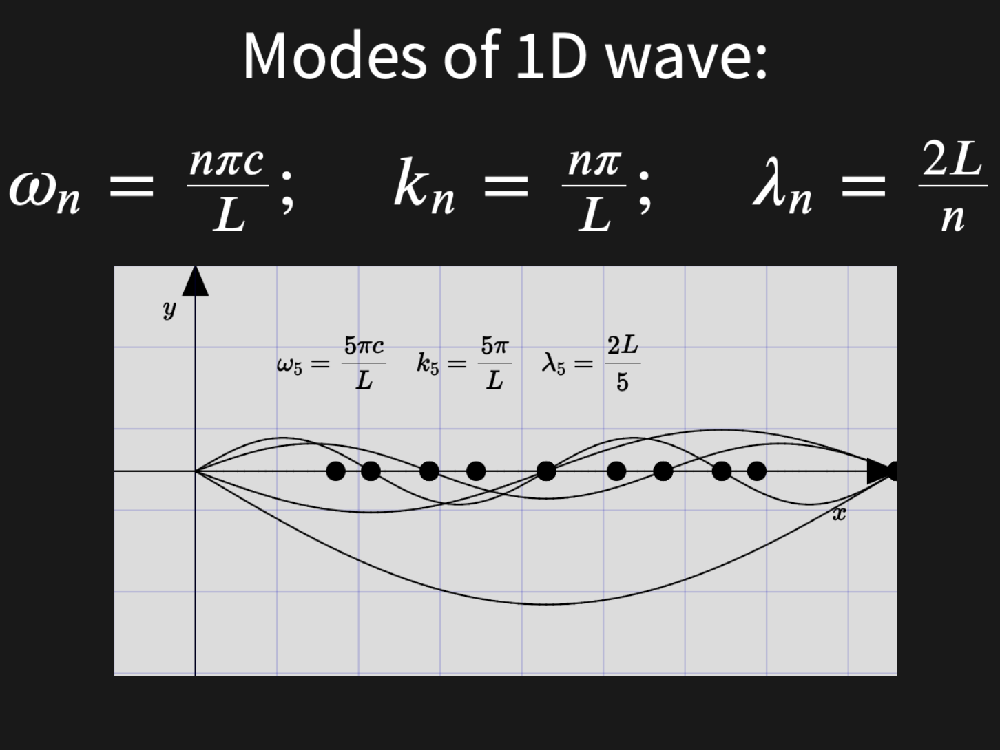

|  |
| :-------------------: |
|  How do we get here?  |

Reveal.js presentation and notes around the 1D wave equation and its modal frequencies


## How To View

To view this presentation you can do one of the following

- clone the repository

```sh
git clone https://github.com/mhamilt/1D-Wave-in-5-minutes
```

 - [download the `.zip`](https://github.com/mhamilt/1D-Wave-in-5-minutes/archive/refs/heads/main.zip)


 After that, simply open the `index.html`.

 ## How to edit

 If you you would like to build upon this presentation, see the [Reveal.js Full Setup instructions](https://revealjs.com/installation/#full-setup). After install, navigate to this directory and run:

 ```
 npm start
 ```
